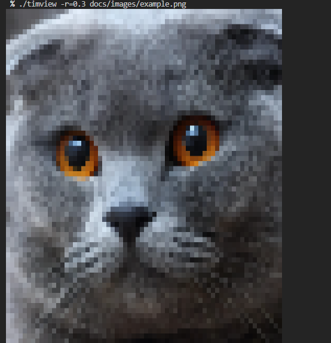
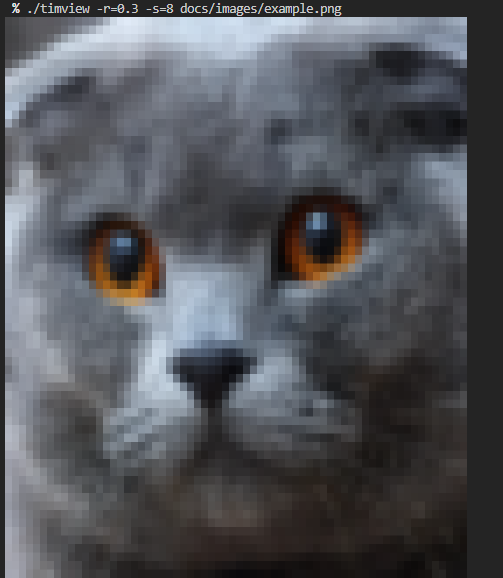
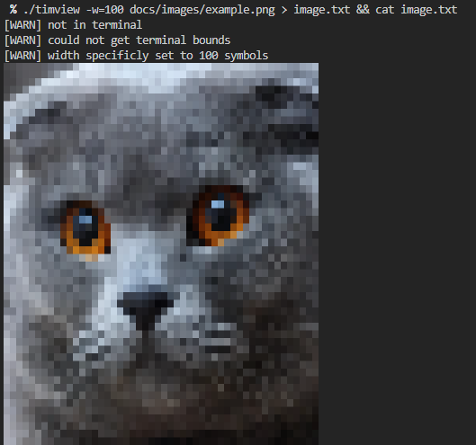
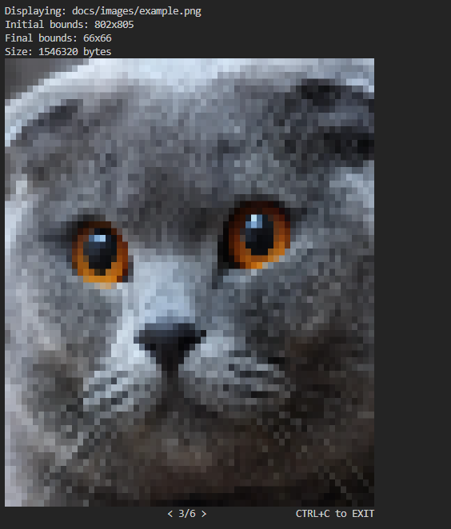

# 🖼️ TIMView - Terminal IMage VIEWer

Simple terminal image viewer written in **Go** that displays images directly in your terminal using **ANSI-escape** codes

## ✨ Features

-   **Images** - displaying most popular image formats (png, jpeg)

-   **True color support** - Full RGB color display in compatible terminals

-   **Smart Scaling** - automatic image scaling to fit your terminal

-   **Customizable** - you can specify scale and smoothing factor

-   **Interactive mode** - scroll and lookup images in specified directory

-   **No bloat** - simple is possible, no unnecessary dependencies

## ⚠️ Warning

This image viewer designed for **previewing** images rather than viewing it in best quality! Almost every time
you get image in low resolution!

## 🚀 Quick Start

```bash
# Clone and build
git clone https://github.com/VerS7/timview --depth=1
cd timview
make all
```

## 🛠️ Usage Examples

```bash
# Display an image
timview image.png

# Specify custom width
timview -w=100 image.png

# Custom scale and smoothing
timview -r=0.3 -s=8 image.png

# Interactive mode
timview images/
```

### Default usage

Default usage of **timview** here. Base scale ratio is 0.5 (half of terminal width) but you can specify it manually (here is 0.3 ratio)



### Smoothing

Every image is resized. **_Oh, really?!_**. Yea, it is. You can specify smooting factor between 2 (default value) and 16 to smooth your image if it too crappy-pixelated. Here is previous image with `-s=8` smoothing factor



### Intermediate output

**Timview** produces any image as plain text, so you can redirect output, for example, to file, why not. Here is example of redirecting output to **image.txt** file and reading this file.



And you get a lot of warnings, but don't worry, you can disable them

### Interactive mode

Displaying single image is too boring. Here is interactive mode! You can specify directory instead of image and view all images in this directory. You can navigate through with arrow keys and exit with **Ctrl+C**. Here is interactive mode with `--extra` info.



## ⚙️ Configuration Options

| Name      | Flag       | Description                                                          | Default                      |
| --------- | ---------- | -------------------------------------------------------------------- | ---------------------------- |
| ratio     | `-r`       | Scaling of your image in terminal                                    | 0.5 (half of terminal width) |
| smoothing | `-s`       | Smoothing factor between 2 and 16                                    | 2                            |
| width     | `-w`       | Width of your image in symbols. Almost always auto-detected          | 0                            |
| no warn   | `--nowarn` | Disable [WARN] messages                                              | false                        |
| extra     | `--extra`  | Extra information about your image (size, bounds...)                 | false                        |
| freeze    | `--freeze` | Freeze your terminal with waiting for any key after displaying image | false                        |

## 🎯 How It Works

**TIMView** uses **ANSI-escape** codes to set foreground and background colors for each character position, effectively turning your terminal into a pixel grid.
For better displaying **TIMView** uses hack with `▀` (Upper Half Block) unicode symbol to represent two pixel rows: foreground color is upper and background is lower. The image is downscaled while preserving as much detail as possible.

I don't really know who invented this method, but I was inspired by this video [Minecraft, but it runs in the terminal](https://www.youtube.com/watch?v=6zfXM-6yPJQ)

## 📋 Requirements

-   **Terminal**: True color support (any modern terminal)

-   **Go**: Version 1.20 or higher (for building from source)

## 🖥️ Supported platforms

| Tested | Platform     | Terminal   |
| ------ | ------------ | ---------- |
| ✅     | Windows      | PowerShell |
| ✅     | Windows      | Cmd        |
| ✅     | Linux/Ubuntu | Bash       |
| ✅     | Linux/Ubuntu | Zshell     |

Any other platforms may be supported but not tested

## 📢 Goals

-   ✅ First version!

-   ✅ Interactive mode

-   ✅ Test on Linux

-   ✅ Test on Windows

-   ❓ Concurrent resizing

-   ❓ More image formats (via ffmpeg, etc.)

-   ❓ Platform support for almost every platform possible
